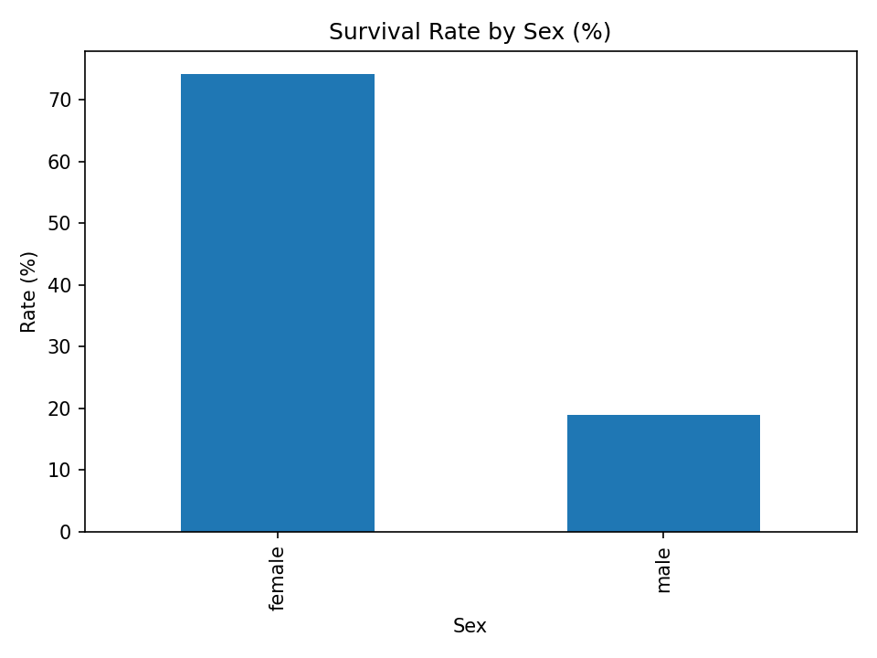
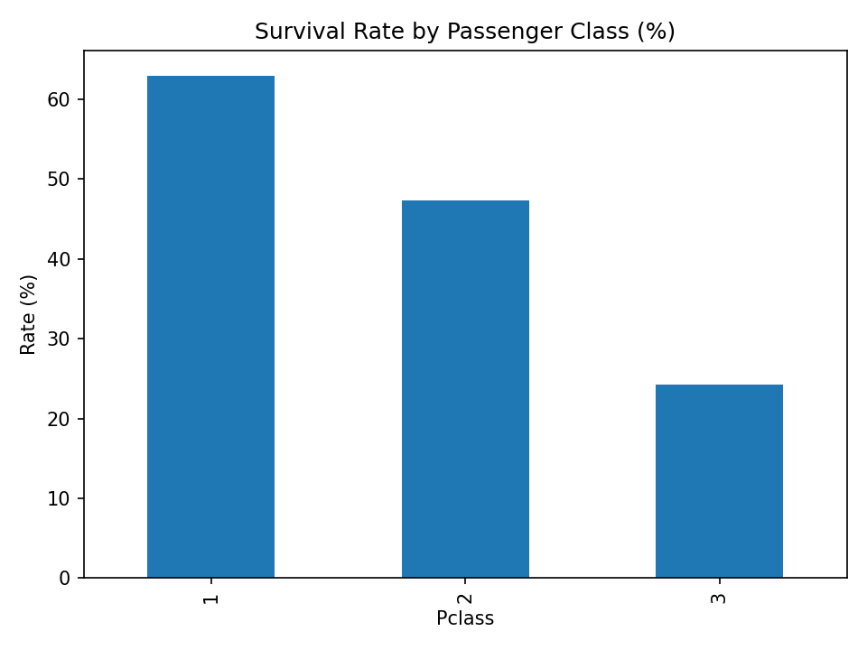

# EDA Titanic — Storytelling with Pandas & Matplotlib

Exploratory Data Analysis (EDA) of the **Titanic** dataset to answer:  
**“Who was more likely to survive on the Titanic, and why?”**

This project focuses on a storytelling notebook, clean visualizations, and a reproducible environment (Docker / virtualenv).

---

## ✨ Outcome at a Glance
- Main notebook: `notebooks/eda_titanic.ipynb` — narrative: intro → data → cleaning → exploration → insights → limitations → next steps.
- ≥5 clean charts saved to `reports/figures/` and embedded in this README.
- Environment runnable via **Docker Compose** *or* **virtualenv (venv)**.


> Example insights (your results may vary):
> - **Women** and **children** tend to have higher survival rates.
> - **1st class (Pclass=1)** fared much better than **3rd class**.
> - Higher **fare** correlates with a higher chance of survival (proxy for class/evacuation access).


---

## 🧾 Data
Source: **Kaggle — Titanic: Machine Learning from Disaster**

- **Manual**: download `train.csv` (and `test.csv`) → place in `data/raw/`.
- **CLI (optional)**:
  ```bash
  pip install kaggle
  # save credentials to ~/.kaggle/kaggle.json (chmod 600 on Linux/macOS)
  kaggle competitions download -c titanic -p data/raw
  cd data/raw && unzip titanic.zip && rm titanic.zip && cd -
  ```

> ⚠️ **Data Ethics**: keep Kaggle attribution; avoid committing raw data to public repos.

---

## 🚀 Getting Started

### Option A — Docker Compose (recommended)
1) Build & run:
```bash
docker compose up --build
```
2) Open the printed URL (usually `http://localhost:8888`) → open `notebooks/02_eda_titanic.ipynb`.

**`docker/Dockerfile` (minimal):**
```dockerfile
FROM python:3.11-slim
WORKDIR /app
RUN pip install --no-cache-dir jupyterlab numpy pandas matplotlib
EXPOSE 8888
CMD ["jupyter", "lab", "--ip=0.0.0.0", "--no-browser", "--allow-root"]
```

**`compose.yaml`:**
```yaml
services:
  jupyter:
    build: ./docker
    ports: ["8888:8888"]
    volumes:
      - ./notebooks:/app/notebooks
      - ./data:/app/data
      - ./reports:/app/reports
```

### Option B — Virtualenv (venv)
```bash
python -m venv .venv
source .venv/bin/activate        # Windows: .\.venv\Scripts\Activate.ps1
python -m pip install --upgrade pip
pip install -r requirements.txt  # or: pip install jupyterlab numpy pandas matplotlib
jupyter lab
```

---

## 📒 Notebook & Storytelling
**`notebooks/eda_titanic.ipynb`** contains:

1. **Introduction** — research question & context.  
2. **Data Overview** — `head/info/describe`, missing values.  
3. **Cleaning** — fix dtypes & simple imputations (e.g., `Embarked`, `Fare`, `AgeBucket`).  
4. **Exploratory Analysis** — aggregations (`groupby/agg/pivot`) & Matplotlib visuals:
   - Survival rate by Sex  
   - Survival rate by Pclass  
   - Age distribution vs Survival (hist)  
   - Survival by Embarked  
   - Fare vs Survival (boxplot)  
5. **Insights** — concise “so what?” takeaways.  
6. **Limitations** — historical dataset, sampling bias, missing context.  
7. **Next Steps** — baseline modeling (logistic regression), additional features.

> Save visuals to `reports/figures/*.png` and embed 2–3 below.

---

## 🖼️ Visual Samples (placeholders)
Replace these with your actual figures after running the notebook.




---

## 🔁 Reproducibility
- Dependencies pinned in `requirements.txt`.
- Standardized runtime via Docker (`python:3.11-slim`).
- Raw data **not** committed; folder presence kept with `.gitkeep`.

---

## 🔧 Troubleshooting
- **Jupyter token/URL issues** → stop container (`Ctrl+C`), re-run `docker compose up`; or `python -m jupyter lab` in venv.
- **Windows PowerShell activation policy**:
  ```powershell
  Set-ExecutionPolicy -Scope CurrentUser RemoteSigned
  ```
- **Kaggle CLI errors** → ensure `~/.kaggle/kaggle.json` exists with correct permissions.

---

## 🧭 Git Workflow (recommended)
- Branch: `feat/eda-titanic` → **Pull Request** → merge to `main`.
- **Conventional Commits** examples:
  ```
  feat(eda): add survival-by-pclass analysis & chart
  chore(docker): add compose for jupyter
  docs(readme): embed figures and insights
  ```
- Release:
  ```bash
  git tag v0.1.0 -m "EDA Titanic: initial release"
  git push origin v0.1.0
  ```
  Then draft a **GitHub Release** (include 2–3 figures for visual appeal).

---

## 📄 License & Attribution
- Code: **MIT License** (or your preferred OSI license).  
- Data: © respective data owners (Kaggle). Used for educational purposes only.

---

Happy exploring! 🚢📊
